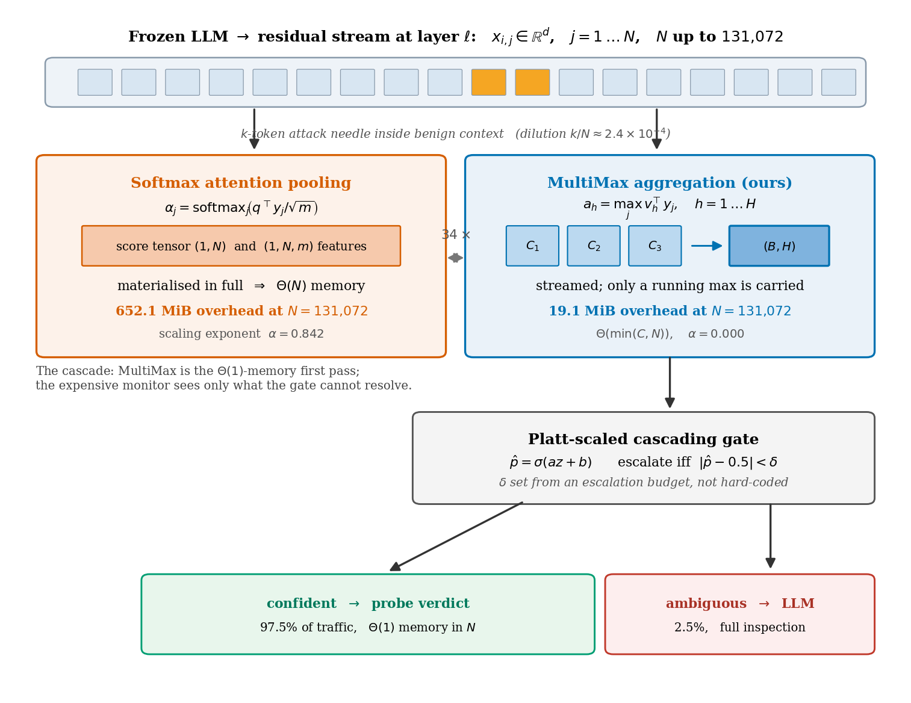

# Max Duty, Minimum Overhead

**$\mathcal{O}(1)$-Memory Activation Probing and the Scaling Limits of Long-Context Safety Monitors**


Activation probes are deployed safety infrastructure — shipped inside frontier assistants
and used as white-box members of untrusted-monitor ensembles. They are also **memory
bound**: an attention-pooled probe allocates memory proportional to the context, which is
the one quantity an adversary controls.

This repo isolates **aggregation** as the independent variable, holding the token
transform fixed, and measures four reductions across $N \in [128,\;131{,}072]$.

---

## Executive summary

| | finding |
|---|---|
| **Systems win** | MultiMax overhead is **flat at 19.1 MiB** from $N{=}8{,}192$ to $131{,}072$ ($\alpha{=}0.000$) vs **652.1 MiB** for softmax pooling ($\alpha{=}0.842$). Self-attention hits 10.1 GiB and OOMs. |
| **Optimisation fix** | The hard-max subgradient touches only $H$ tokens/step. At $S{=}0.10$ this stopped learning entirely (**0.00** recall). Normalised Boltzmann annealing restores **1.00**. |
| **Calibration** | Sum-of-maxima logits are upward-biased. Platt scaling cuts Brier **0.0538 → 0.0122**, accuracy **0.931 → 0.988**. |
| **Honest limit** | Under a fragmented attack MultiMax and softmax **fail together at $m{=}64$**, and past it softmax ranks better (AUROC **0.716 vs 0.523**). We do *not* claim a general detection advantage. |

> **The defensible claim is architectural.** MultiMax is the right $\Theta(1)$-memory
> **first stage of a cascade** — not a replacement for inspection.

---

## Core comparison matrix

| probe | overhead @131k | $\alpha$ | latency @131k | recall @ $S{=}0.10$ | AUROC @ $m{=}256$ |
|---|---|---|---|---|---|
| **MultiMax** (ours) | **19.1 MiB** | **0.000** | **9.205 ms** | **1.00** | 0.523 |
| Mean pooling | 35.1 MiB | 0.000 | 9.438 ms | 0.00 | 0.753 |
| Softmax attention | 652.1 MiB | 0.842 | 12.729 ms | 0.68 | **0.716** |
| Self-attention | 10381.6 MiB | 1.960 | **OOM** | — | — |

Every cell is read from [`benchmark_results.json`](benchmark_results.json) and verified by
[`tools/check_claims.py`](tools/check_claims.py).

---

## Figures



| memory & latency scaling | annealing | distributed attack |
|---|---|---|
|  |  |  |

---

## Mathematical principles

**MultiMax aggregation.** With token features $y_j = \phi(x_j) \in \mathbb{R}^m$:

$$a_h = \max_{1 \le j \le N} v_h^\top y_j, \qquad \text{logit} = \sum_{h=1}^{H} a_h + b$$

Padding is monotone — appending benign tokens can only add candidates to the max, never
dilute the incumbent.

**Normalised Boltzmann operator** (training only; annealed to the hard max for deployment):

$$\mathrm{smax}_\tau(s) = \tau \log\!\left(\frac{1}{N}\sum_{j=1}^{N} e^{s_j/\tau}\right)
\;\xrightarrow[\tau \to 0]{}\; \max_j s_j
\;\qquad\xrightarrow[\tau \to \infty]{}\; \frac1N\sum_j s_j$$

The $1/N$ is **load-bearing**: plain LogSumExp injects $H\tau\log N$ — measured **+42** at
$\tau{=}1,N{=}512$ and **+68** at $N{=}16{,}384$. Being *length-dependent*, it corrupts the
train→deploy transfer specifically.

**Straight-through clamp.** `torch.clamp` has derivative $\mathbb{1}[|z|<c]$ — identically
zero when saturated, so the guard *causes* the vanishing gradient it was added to prevent
(measured: grad norm `0.000e+00`). We use

$$\widetilde\Pi(z) = z + \mathrm{sg}\!\left(\Pi_{[-c,c]}(z) - z\right), \qquad \widetilde\Pi'(z) \equiv 1$$

**Platt calibration.** $\hat p = \sigma(az + b)$. Temperature scaling alone is
*structurally* insufficient: a sum of $H$ maxima is upward-biased, and rescaling cannot
move a mis-centred boundary.

**Budget-driven gate.** Escalate iff $|\hat p - 0.5| < \delta$, with $\delta$ taken as the
target-rate quantile of $|\hat p - 0.5|$ rather than hard-coded. Targets of 1/2/5/10% land
at **1.2/2.5/5.0/10.0%**.

---

## Reproducibility

```bash
pip install torch transformers datasets scikit-learn matplotlib

# module self-tests (strict warnings)
python -W error::UserWarning multimax_probe.py          # STE clamp, annealing, dilution
python -W error::UserWarning cascading_classifier.py    # Platt calibration + cost model

# benchmarks  (Suite A/B/C ~45 min; Suite D ~5 min on an 8 GiB GPU)
python benchmark_suite.py            # --quick for a smaller ladder
python suite_d_chunk_ablation.py     # answers "is O(1) just chunking?"

# verification and artifacts
python tools/check_claims.py         # 32/32 prose-vs-artifact checks
python tools/check_tex.py            # LaTeX structure + amsthm numbering
python tools/make_figures.py               # figures/*.pdf and *.png

# paper
latexmk -pdf paper.tex               # -> paper.pdf
```

> **Note on determinism.** Benchmarks are seeded and reproduce exactly run-to-run on the
> same device. Figures and paper numbers are generated *from* `benchmark_results.json`, so
> they cannot drift from the data by hand-editing.

---

## Directory map

```
multimax_probe.py            MultiMaxProbe + Softmax/Mean/SelfAttn baselines,
                             STEClamp(autograd.Function), anneal_tau()
cascading_classifier.py      Platt calibration, budget-driven delta, cost model
benchmark_suite.py           Suite A (systems) / B (weak signal) / C (distributed)
suite_d_chunk_ablation.py    Suite D: chunk x length, the O(1) rebuttal


paper.tex / references.bib   manuscript + bibliography
math_formulation.tex         standalone derivations (18 numbered results)
BENCHMARK_NOTES.md           measured tables, bugs found, limitations

benchmark_results.json       Suites A-D, verdicts          <- single source of truth
logs/calibration_report.json Platt metrics + delta sweep
tools/make_figures.py        all figures, driven from the JSON artifact
tools/check_claims.py        verifies prose against artifacts (32 checks)
tools/check_tex.py           LaTeX structural audit + numbering

01..05_*.py, src/            earlier mechanistic-interpretability phases
                             (SAE decomposition, ensemble subspaces)
```

Heavy caches (`artifacts/*.pt`, 143 MB) are gitignored — regenerate with the phase scripts.

---

## Limitations

- **Synthetic activations.** Gaussian backgrounds, one fixed additive attack direction.
  Real misuse features are neither isolated nor axis-aligned; transfer is untested.
- **Benchmark C trains on the same $m$ it evaluates** — generous to the defender. An
  unknown-$m$ adversary is untested.
- **Threshold drift** grows as $\sqrt{2\log N}$ (benign maximum); the protocol recalibrates
  per length rather than characterising the drift.
- **The cascade's second stage is simulated** — it exercises routing and cost arithmetic,
  and is *not* evidence about a real monitor. Pricing constants are illustrative.
- **Single scale**: one width, one head count, one GPU.
- **Figures use Type 3 fonts** — an Application Control policy on the build host blocks
  fontTools subsetting, so Type 42 is unavailable here.

## License

MIT.
