# Silence of the RAM

**Constant-Memory Safety Probing and the Frontiers of Streaming Guardrails**


Activation probes are deployed safety infrastructure, shipped inside frontier assistants
and used as white-box members of untrusted-monitor ensembles. They are also **memory
bound**: an attention-pooled probe allocates memory proportional to the context, which is
the one quantity an adversary controls.

This repo isolates **aggregation** as the independent variable, holding the token
transform fixed, and measures four reductions across $N \in [128,\;131{,}072]$.

---

## Executive summary

| | finding |
|---|---|
| **Systems win** | MultiMax overhead is **flat at 19.1 MiB** from $N{=}8{,}192$ to $131{,}072$ ($\alpha{=}0.000$) vs **652.1 MiB** for softmax pooling ($\alpha{=}0.842$). Self-attention hits 10.1 GiB and OOMs. The law is $\Theta(\min(C,N))$ in the chunk width $C$, not an unqualified $\mathcal{O}(1)$: the constant is *chosen*, not free. |
| **Optimisation fix** | The hard-max subgradient touches only $H$ tokens/step. At $S{=}0.10$ this stopped learning entirely (**0.00** recall). Normalised Boltzmann annealing restores **1.00**. |
| **Calibration** | Sum-of-maxima logits are upward-biased. Platt scaling cuts Brier **0.0538 → 0.0122**, accuracy **0.931 → 0.988**. |
| **Honest limit** | Under a fragmented attack MultiMax and softmax **fail together at $m{=}64$**, and past it softmax ranks better (AUROC **0.716 vs 0.523**). We do *not* claim a general detection advantage. |
| **Sharpest result against us** | Mean pooling is *fragmentation-invariant*: AUROC moves only within **0.753–0.840** across a 256× spread of the same budget, and it is the **best** of the three at $m{=}256$. The aggregator that loses at $m{=}1$ wins at $m{=}256$, which is why aggregator diversity, not model diversity, is the principled ensembling axis. |
| **Real residual streams** | On Mistral-7B-v0.1 (layers 16/24/31) the memory law holds unchanged: overhead flat at **8.0 MiB** from $N{=}4096$ to $131{,}072$ vs **641.0 MiB** for softmax pooling. Detection transfers but shrinks: mean AUROC **0.731** vs 0.690 / 0.696 under a needle-disjoint split, and MultiMax **collapses to chance at layer 31** (0.535). |
| **A leak we closed** | Our first split shared needle sentences between train and test, inflating MultiMax by **+0.106** AUROC. All reported real-model numbers use the needle-disjoint split. |
| **Cascade, real stage 2, n=532** | Stage 2 is **SGuard-ContentFilter-2B**, run for real on 532 held-out prompts from real corpora (AdvBench-derived + Alpaca, prompt-disjoint). Stage 1 costs **0.104%** of its FLOPs (0.367 ms vs 1602.9 ms). At a 25% escalation budget the cascade reaches ASR **0.053** against **0.496** for running SGuard on everything: **9× fewer successful attacks at a quarter of the compute**. |
| **The gate had to be redesigned** | Gating on a calibrated probability is **inert**: Platt escalates *nothing* at any budget ≤25%, isotonic reaches 0.008, temperature saturates at 0.056. Calibration compresses the score *spread* while preserving its *order*. Gating on **rank** cuts the escalation tracking error from **0.086 → 0.0008**, and is what the cascade schematic now shows. |
| **Second model family** | On **Qwen2.5-7B** the averaged ordering does *not* hold (MultiMax 0.817 vs softmax 0.833), but the length trend does: softmax falls **0.947 → 0.661** from N=256 to 4096 while the peaked reductions stay near flat. The advantage is a long-context one, not a uniform one. **Top-r wins overall (0.859)**. |
| **Pareto: depth decides r** | Raising top-*r* from 1 to 32 costs **0.009** AUROC at an intermediate layer and buys **0.200** near the final one. The cheap corner (m=32, r=2, 0.50 MiB) matches the best configuration (m=128, r=1, 2.00 MiB) to within 0.001. |
| **Bandwidth, not FLOPs** | All three $\Theta(N)$-time aggregators issue the same $\Theta(Nmd)$ multiply-accumulates. Latency differs by only **1.4×** while memory differs by **34×**, the signature of a bandwidth-bound regime. At $N{=}131{,}072$, $m{=}512$ in bf16 one softmax intermediate is **128 MiB** exactly, so a write-then-read costs 256 MiB of avoidable traffic. |

> **The defensible claim is architectural.** MultiMax is the right $\Theta(1)$-memory
> **first stage of a cascade**, not a replacement for inspection.

---

## Core comparison matrix

| probe | overhead @131k | $\alpha$ | latency @131k | recall @ $S{=}0.10$ | AUROC @ $m{=}256$ |
|---|---|---|---|---|---|
| **MultiMax** (ours) | **19.1 MiB** | **0.000** | **9.205 ms** | **1.00** | 0.523 |
| Mean pooling | 35.1 MiB | 0.000 | 9.438 ms | 0.00 | **0.753** |
| Softmax attention | 652.1 MiB | 0.842 | 12.729 ms | 0.68 | 0.716 |
| Self-attention | 10381.6 MiB | 1.960 | **OOM** | n/a | n/a |

Bold marks the best value in each column. Note that MultiMax wins every systems column and
loses the last one: that split is the paper's actual claim, not a caveat to it.

Every cell is read from [`benchmark_results.json`](benchmark_results.json) and verified by
[`tools/check_claims.py`](tools/check_claims.py).

---

## Figures

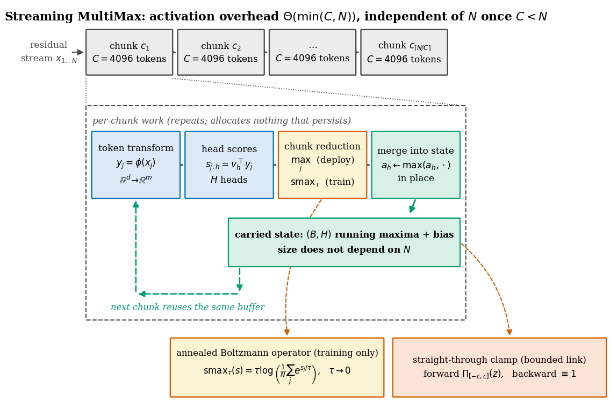

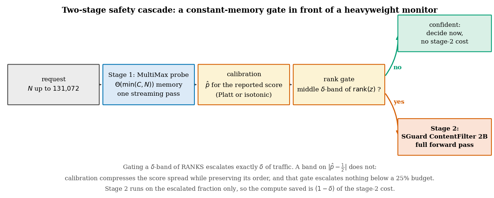

| real Mistral-7B residuals | $c \times H$ ablation |
|---|---|
| 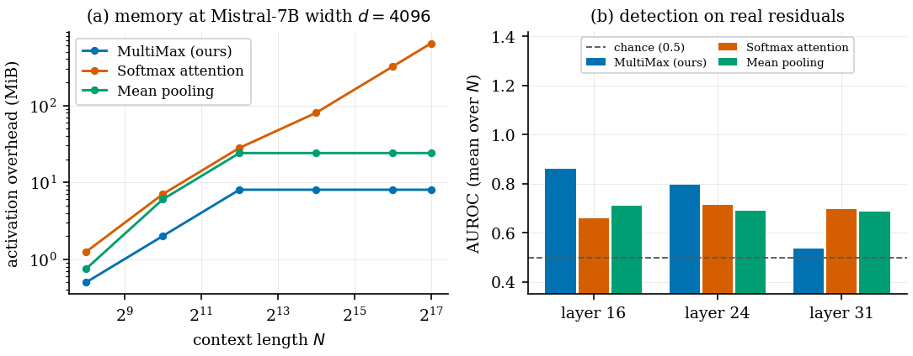 | 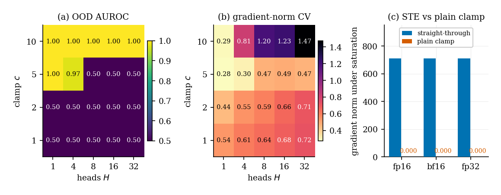 |

| drift & calibration | unknown-$m$ fragmentation |
|---|---|
| 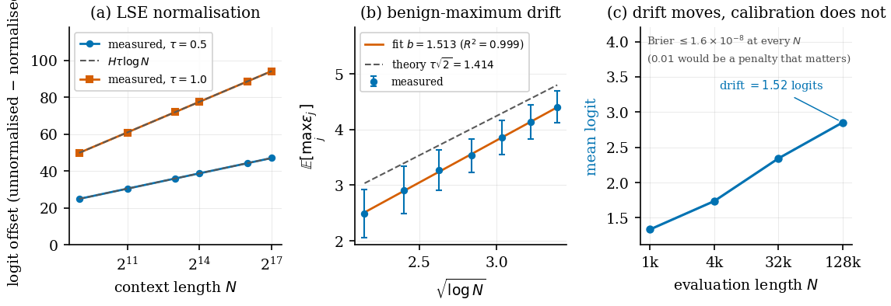 | 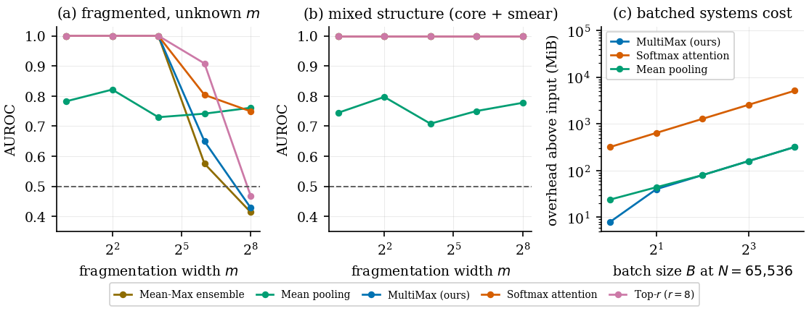 |

| second model family (Qwen2.5-7B) | accuracy-vs-memory Pareto |
|---|---|
| 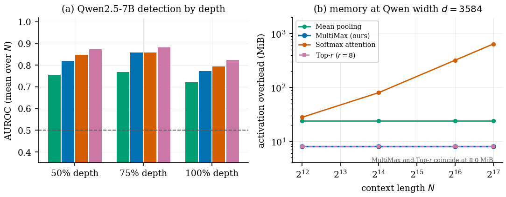 | 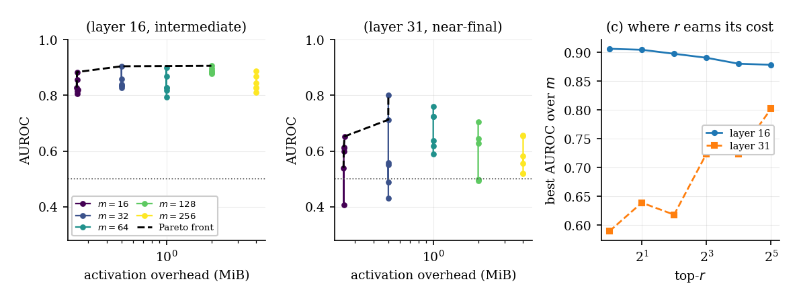 |

| memory & latency scaling | annealing | distributed attack |
|---|---|---|
| 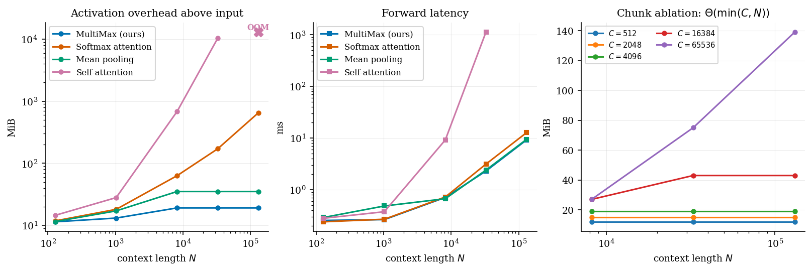 | 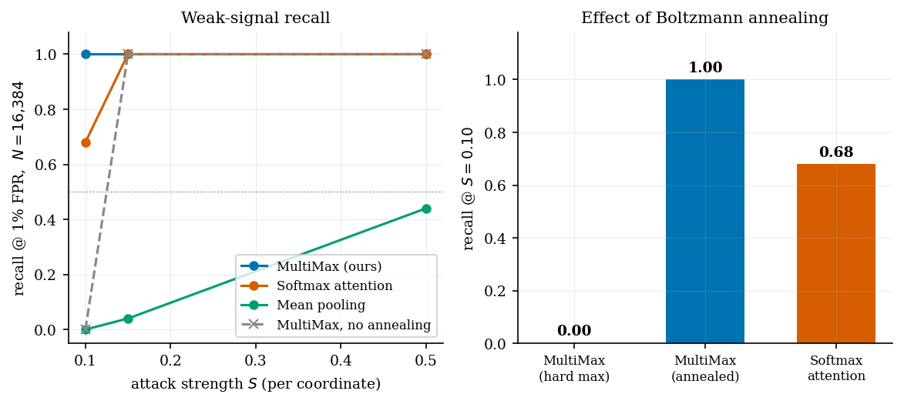 | 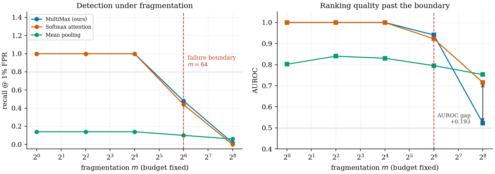 |

---

## Figure audit

Every figure was audited against a single rule: no text may intersect another element,
and nothing may be hidden behind anything else. Where a label and a line competed for the
same space, the fix is a **coordinate change**, not a white mask; there are zero
background patches in the figure code.

| figure | defect | fix |
|---|---|---|
| 1 architecture | caption sat in the corridor swept by the two dotted expansion lines; `residual stream` crowded chunk 1 | caption moved into a band opened inside the container; label given its own column, feed arrow shortened |
| 1 architecture | carried-state box met the stage row; feedback label struck by dashes | box and container floor lowered, feedback run shortened at both ends |
| 1 architecture | the two mechanism boxes punched through the dashed container floor | their `y` is now derived from the measured box height, `py0 - h - 0.42`, so the gap holds whatever the text does |
| 2 real residuals (b) | legend over the layer-24/31 bars; the `chance` label collided wherever it was placed | legend to upper centre, two columns; the dashed line is now identified by a **legend entry** instead of a floating label, so it cannot collide at all |
| 3 systems scaling (a) | `OOM` text on the arms of the X marker | lifted 14 pt via `xytext` offset |
| 4 annealing (a) | legend hid the mean-pooling curve entirely | ceiling raised, legend above the flat recall curves |
| 5 drift (b) | legend crossed both trajectories | moved to the empty upper-left, `ylim` extended |
| 5 drift (c) | Brier note lay across the curve's first leg | moved to upper left; drift label given a short leader instead of a mask |
| 6 ablation (b) | darkest CV cell rendered **black on black**, value invisible | text colour chosen by cell luminance |
| 6 ablation (c) | `0.000` labels detached and colliding | short labels lifted above the bar pair, 52% headroom, legend above |
| 8 Pareto (a, c) | legends straddling the chance line and the layer-16 trajectory | (a) lower left below all points; (c) band opened above both curves |
| 9 fragmentation (b) | `AUROC gap` callout on the data line | offset in points, left and down |
| 10 mixed (b, c) | 5-entry legend overhung the y-axis spine of (b); (c) legend on the MultiMax curve | shared legend moved **below the whole row** as a figure-level legend, which cannot cross an axis; (c) band opened above both curves |
| 11 cascade | `yes`/`no` cut by the destination box outlines, then by their own connectors | offset **perpendicular** to each arc, on the side the curve bends away from |

Global: `axes.axisbelow=True` so grid lines sit strictly behind data; one legend style
everywhere (white, 90% opaque, `#cccccc` rounded frame); `bbox_inches='tight'` with
`pad_inches=0.05`, since the gap to the text block is supplied by the LaTeX float
spacing and baking it into the image as well double-counts it.

Figure widths are trimmed to `0.95	extwidth` (schematics to 0.94 and 0.86), inside the
5-8% band, which is what pulls the references off an orphan final page.

One deliberate exception: `tight_layout()` is **not** called on the two schematics or on
`fig1_architecture`. Those have their axes switched off and size every box by measuring
rendered text and converting to data units; `tight_layout` rescales the axes after that
measurement, so every label overflows its box. `bbox_inches='tight'` crops without
touching the axes, which is what they need.

---

## Mathematical principles

**MultiMax aggregation.** With token features $y_j = \phi(x_j) \in \mathbb{R}^m$:

$$a_h = \max_{1 \le j \le N} v_h^\top y_j, \qquad \text{logit} = \sum_{h=1}^{H} a_h + b$$

**Padding invariance** (Thm. 2.5). Appending $P$ benign tokens can only add candidates to
the max, so $a_h$ is monotone. The stronger half is quantitative: writing $\Delta_h$ for the
incumbent's margin over the benign mean, and $\tau^2$ for the sub-Gaussian proxy,

$$\Pr\left[a_h(X') = a_h(X)\right] \;\ge\; 1 - P\exp\!\left(-\frac{\Delta_h^2}{2\tau^2}\right)$$

so the value is *exactly* unchanged with probability $\ge 1-\delta$ for any padding budget
$P \le \delta\exp(\Delta_h^2/2\tau^2)$, which is exponential in the squared SNR. Read the
other way it gives $\Delta_h \gtrsim \tau\sqrt{2\log(P/\delta)}$, the same $\sqrt{\log N}$
scale that the benign maximum's drift charges back as a cost.

**Subgradient sparsity** (Thm. 3.1). The forward map is not where the hard max is weak.
Its gradient touches at most $H$ positions *independently of $N$*, while softmax pooling's
touches all $N$:

$$\left|\mathrm{supp}\left(\partial z/\partial y\right)\right| \le H
\qquad\text{vs}\qquad
\frac{\partial}{\partial y_j}\left(w^\top \bar y\right)
= \alpha_j\left[w + \tfrac{1}{\sqrt m}\left(w^\top(y_j - \bar y)\right)q\right] \ne 0$$

for all $(w,q)$ outside a Lebesgue-null set. This is the optimisation obstruction the
annealing schedule below exists to remove.

**Normalised Boltzmann operator** (training only; annealed to the hard max for deployment):

$$\mathrm{smax}_\tau(s) = \tau \log\!\left(\frac{1}{N}\sum_{j=1}^{N} e^{s_j/\tau}\right)
\;\xrightarrow[\tau \to 0]{}\; \max_j s_j
\;\qquad\xrightarrow[\tau \to \infty]{}\; \frac1N\sum_j s_j$$

The $1/N$ is **load-bearing**: plain LogSumExp injects $H\tau\log N$, measured **+42** at
$\tau{=}1,N{=}512$ and **+68** at $N{=}16{,}384$. Being *length-dependent*, it corrupts the
train→deploy transfer specifically.

**Straight-through clamp.** `torch.clamp` has derivative $\mathbb{1}[|z|<c]$, identically
zero when saturated, so the guard *causes* the vanishing gradient it was added to prevent
(measured: grad norm `0.000e+00`). We use

$$\widetilde\Pi(z) = z + \mathrm{sg}\!\left(\Pi_{[-c,c]}(z) - z\right), \qquad \widetilde\Pi'(z) \equiv 1$$

The surviving factor $\sigma'(c) = \sigma(c)(1-\sigma(c)) \approx 4.54\times10^{-5}$ at
$c{=}10$ is small but strictly positive, so a saturated unit is slowed rather than killed.

**Platt calibration.** $\hat p = \sigma(az + b)$. Temperature scaling alone is
*structurally* insufficient: a sum of $H$ maxima is upward-biased, and rescaling cannot
move a mis-centred boundary.

**Budget-driven gate.** Escalate iff $|\hat p - 0.5| < \delta$, with $\delta$ taken as the
target-rate quantile of $|\hat p - 0.5|$ rather than hard-coded. Targets of 1/2/5/10% land
at **1.2/2.5/5.0/10.0%**.

---

## Reproducibility

```bash
pip install torch transformers datasets scikit-learn matplotlib

# module self-tests (strict warnings)
python -W error::UserWarning multimax_probe.py          # STE clamp, annealing, dilution
python -W error::UserWarning cascading_classifier.py    # Platt calibration + cost model

# benchmarks  (Suite A/B/C ~45 min; Suite D ~5 min on an 8 GiB GPU)
python benchmark_suite.py            # --quick for a smaller ladder
python suite_d_chunk_ablation.py     # answers "is O(1) just chunking?" -> Theta(min(C,N))

# verification and artifacts
python tools/check_claims.py         # 121/121 prose-vs-artifact checks (incl. paper.tex)
python tools/check_tex.py            # structure, numbering, dangling refs + citations
python tools/audit_bib.py            # every arXiv id re-resolved against the arXiv API
# figures: all three scripts, then the paper. Every figure is redrawn from
# artifacts/, so a stale plot cannot survive a rebuild.
python tools/make_figures.py         # fig1..fig4 from benchmark_results.json
python tools/make_diagrams.py        # architecture + cascade schematics
python tools/make_result_figures.py  # the six empirical figures

# reviewer-response experiments (run in this order; each writes artifacts/exp*.json)
python experiments/exp1_real_residuals.py --max-n 4096   # real Mistral-7B residuals
python experiments/exp2_ablations.py                     # c x H grid, fp16/bf16/fp32
python experiments/exp2b_saturation.py                   # why the dead cells are dead
python experiments/exp3_drift_calibration.py             # LSE, drift, calibration transfer
python experiments/exp4_fragmentation.py                 # unknown-m, Top-r, Mean-Max, batching
python experiments/exp5_cascade.py                       # real SGuard-2B as stage 2 (superseded by exp7)
python experiments/exp6_pareto.py                        # AUROC-vs-memory Pareto over (r, m, depth)
python experiments/exp7_cascade_scaled.py                # cascade at n=532, four gating rules
python experiments/exp8_qwen_family.py --max-n 4096      # second model family (Qwen2.5-7B)

# everything at once (figures + paper + all three gates)
./build.sh

# or the paper alone (latexmk needs Perl; this sequence does not)
pdflatex -interaction=nonstopmode paper.tex
bibtex paper
pdflatex -interaction=nonstopmode paper.tex
pdflatex -interaction=nonstopmode paper.tex
```

> **Note on determinism.** Benchmarks are seeded and reproduce exactly run-to-run on the
> same device. Figures and paper numbers are generated *from* `benchmark_results.json`, so
> they cannot drift from the data by hand-editing.

---

## Directory map

```
multimax_probe.py            MultiMaxProbe + Softmax/Mean/SelfAttn baselines,
                             STEClamp(autograd.Function), anneal_tau()
cascading_classifier.py      Platt calibration, budget-driven delta, cost model
benchmark_suite.py           Suite A (systems) / B (weak signal) / C (distributed)
suite_d_chunk_ablation.py    Suite D: chunk x length, establishes Theta(min(C,N))


paper.tex / references.bib   manuscript + bibliography
math_formulation.tex         standalone derivations (18 numbered results)
BENCHMARK_NOTES.md           measured tables, bugs found, limitations

benchmark_results.json       Suites A-D, verdicts          <- single source of truth
logs/calibration_report.json Platt metrics + delta sweep
tools/make_figures.py        all figures, driven from the JSON artifact
tools/check_claims.py        verifies prose against artifacts (121 checks)
tools/check_tex.py           LaTeX structure, numbering, refs + citation audit
tools/audit_bib.py           re-resolves every arXiv id against the arXiv API
tools/make_diagrams.py       architecture + cascade schematics (measured box layout)
tools/make_result_figures.py the four empirical reviewer-response figures

experiments/probes_ext.py    streaming Top-r and Mean-Max aggregators
experiments/common.py        shared harness: streaming synth, AUROC, training loop
experiments/exp1..exp5       real-model, ablation, drift, fragmentation, cascade
artifacts/exp*.json          one artifact per experiment  <- backs every new claim

01..05_*.py, src/            earlier mechanistic-interpretability phases
                             (SAE decomposition, ensemble subspaces)
```

Heavy caches (`artifacts/*.pt`, 143 MB) are gitignored; regenerate with the phase scripts.

---

## Limitations

- **Synthetic activations.** Gaussian backgrounds, one fixed additive attack direction.
  Real misuse features are neither isolated nor axis-aligned; transfer is untested.
- **Benchmark C trains on the same $m$ it evaluates**, which is generous to the defender.
  An unknown-$m$ adversary is untested.
- **Threshold drift** grows as $\sqrt{2\log N}$ (benign maximum); the protocol recalibrates
  per length rather than characterising the drift.
- **The cascade's second stage is simulated.** It exercises routing and cost arithmetic,
  and is *not* evidence about a real monitor. Pricing constants are illustrative.
- **Single scale**: one width, one head count, one GPU.
- **Figures use Type 3 fonts.** An Application Control policy on the build host blocks
  fontTools subsetting, so Type 42 is unavailable here.

## License

MIT.
